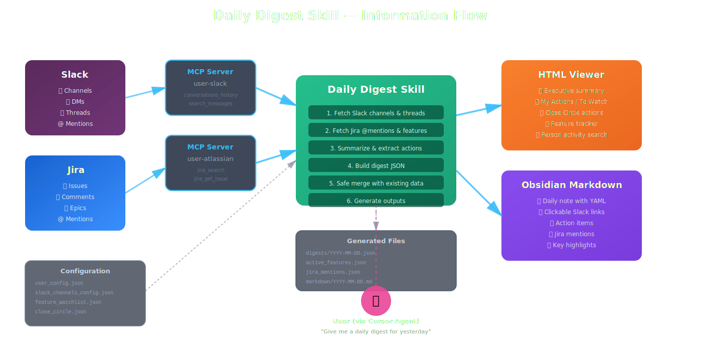

# Cursor Skills

A collection of AI agent skills for [Cursor](https://cursor.com) that integrate with Slack and Jira to automate daily workflows.

## Available Skills

| Skill                                                    | Description                                                                                                                                                                                                                                                                      |
| -------------------------------------------------------- | -------------------------------------------------------------------------------------------------------------------------------------------------------------------------------------------------------------------------------------------------------------------------------- |
| **[Daily Digest](.cursor/skills/daily-digest/SKILL.md)** | - Summarizes your Slack channels, DMs, and Jira mentions into a browsable daily report. - Track actions for you and your team members, which you can mark as done. - Track Features in Jira which you want to watch for progress & get summary updates that span Jira and Slack. |

### Daily Digest: what you get

After you run a digest (e.g. *"Give me a daily digest for yesterday"* in Agent chat):

- **`digests/YYYY-MM-DD.json`** — Structured digest for that day (under [`.cursor/skills/daily-digest/digests/`](.cursor/skills/daily-digest/digests/))
- **HTML viewer** — Browse all digests, actions, and feature tracking in the browser ([`viewer/`](.cursor/skills/daily-digest/viewer/))
- **Markdown export** — `YYYY-MM-DD.md` for [Obsidian](https://obsidian.md/) or other notes apps (default: [`markdown/`](.cursor/skills/daily-digest/markdown/); optional vault path via `obsidian_digest_path` in `user_config.json`)
- **Jira integration** — Feature watchlist + `@mention` tracking in the viewer (`active_features.json`, `jira_mentions.json`; see [SKILL.md](.cursor/skills/daily-digest/SKILL.md))

Full workflow, edge cases (person-only search, safe merge when MCP fails), and step-by-step instructions are in **[Daily Digest SKILL.md](.cursor/skills/daily-digest/SKILL.md)**. A short skill overview lives in **[`.cursor/skills/daily-digest/README.md`](.cursor/skills/daily-digest/README.md)**.

### Architecture

The diagram below shows how information flows from Slack and Jira through MCP servers, into the Daily Digest Skill, and out to the HTML viewer and Obsidian:



## Prerequisites

- [Cursor IDE](https://cursor.com) with Agent mode enabled
- A Slack workspace you can generate tokens for
- A Jira Cloud instance with API token access
- **`npx`** and **`uvx`** on your PATH (Node.js and Python/uv) — used by MCP servers
- **`python3`** — used to export each digest to Markdown ([`export_digest_to_md.py`](.cursor/skills/daily-digest/export_digest_to_md.py)) at the end of a digest run (Step 7 in the skill)

## Quick Start

### 1. Clone the repo

```bash
git clone <repo-url> cursor-skills
cd cursor-skills
```

Open this folder as the **workspace root** in Cursor (the root that contains `user_config.json`).

### 2. Configure MCP servers

The skills talk to Slack and Jira through MCP (Model Context Protocol) servers running locally. Copy the example config and fill in your credentials:

```bash
cp .cursor/mcp.example.json .cursor/mcp.json
```

Edit `.cursor/mcp.json` with your values:

```json
{
  "mcpServers": {
    "user-atlassian": {
      "type": "stdio",
      "command": "uvx",
      "args": ["mcp-atlassian"],
      "env": {
        "JIRA_URL": "https://your-company.atlassian.net",
        "JIRA_USERNAME": "you@company.com",
        "JIRA_API_TOKEN": "<your-jira-api-token>",
        "JIRA_SSL_VERIFY": "true"
      }
    },
    "user-slack": {
      "type": "stdio",
      "command": "npx",
      "args": ["-y", "slack-mcp-server"],
      "env": {
        "SLACK_MCP_XOXC_TOKEN": "<your-xoxc-token>",
        "SLACK_MCP_XOXD_TOKEN": "<your-xoxd-token>",
        "SLACK_MCP_CUSTOM_TLS": "1"
      }
    }
  }
}
```

**Server names:** The example uses `user-slack` and `user-atlassian`. Your Cursor MCP config may use different keys (e.g. `user-user-slack`). The agent must call tools on the servers you actually configured—if the skill references other names, align either `mcp.json` or the skill’s workflow. If tools fail with “server not found,” check names in **Cursor Settings → MCP**.

**Getting your tokens:**

- **Jira API token** — generate one at [id.atlassian.com/manage-profile/security/api-tokens](https://id.atlassian.com/manage-profile/security/api-tokens)
- **Slack tokens** (`xoxc` / `xoxd`) — these are session tokens extracted from the Slack web app. Open Slack in your browser, open DevTools, and find them in cookies/local storage. They rotate, so you may need to refresh them periodically.

### 3. Set up your identity

Copy the example user config and fill in your details:

```bash
cp user_config.example.json user_config.json
```

Edit `user_config.json`. The template matches [`user_config.example.json`](user_config.example.json):

```json
{
  "jira_display_name": "Your Full Name",
  "jira_username": "your-jira-username",
  "jira_email": "you@company.com",
  "jira_account_id": "712020:xxxxxxxx-xxxx-xxxx-xxxx-xxxxxxxxxxxx",
  "slack_username": "your-slack-username",
  "slack_domain": "your-company.enterprise.slack.com",
  "slack_dm_domain": "your-company-internal.slack.com",
  "jira_base_url": "https://your-company.atlassian.net",
  "gh_default_repo": "your-org/your-repo",
  "obsidian_digest_path": ""
}
```

| Key | Purpose |
| --- | --- |
| `slack_username` | Your Slack username (no `@`) — used for self-DM and “my actions” |
| `slack_domain` | Host for **channel** Slack archive links |
| `slack_dm_domain` | Host for **DM** thread links (often different from `slack_domain` in large orgs). Omit only if DMs use the same host as channels |
| `jira_display_name` / `jira_username` | Shown in summaries and fallback Jira search |
| `jira_email` | Optional; helps resolve `jira_account_id` if missing |
| `jira_account_id` | **Recommended** — Atlassian account ID for reliable Jira `@mention` search in comments (`comment ~ "712020:…"`) |
| `jira_base_url` | Your Jira Cloud base URL |
| `gh_default_repo` | Optional default GitHub repo for tooling |
| `obsidian_digest_path` | Optional **absolute path** to a folder in your Obsidian vault. If empty, Markdown exports go to `.cursor/skills/daily-digest/markdown/` |

This file is shared across all skills and is gitignored.

### 4. Configure the Daily Digest (optional but recommended)

Set up which Slack channels to monitor:

```bash
cp .cursor/skills/daily-digest/slack_channels_config.example.json \
   .cursor/skills/daily-digest/slack_channels_config.json
```

Edit `slack_channels_config.json` to list your channels, usergroup mentions, and whether to include DMs:

```json
{
  "channels": ["#your-team-channel", "#your-working-group"],
  "mention_groups": ["@your-usergroup"],
  "include_dms": true
}
```

Optionally, set up the Jira feature watchlist to track feature progress alongside your digest:

```bash
cp .cursor/skills/daily-digest/feature_watchlist.example.json \
   .cursor/skills/daily-digest/feature_watchlist.json
```

Add your Jira feature keys to `feature_watchlist.json`.

### 5. Open the project in Cursor and go

Open the `cursor-skills` folder in Cursor. The skills are automatically discovered. Try:

> "Give me a daily digest for yesterday"

## Viewing digests

### HTML viewer

After generating a digest, serve the built-in HTML viewer:

```bash
npx serve .cursor/skills/daily-digest
```

Then open `http://localhost:3000/viewer/` in your browser (port may differ). The viewer shows all generated digests in a browsable timeline with action items, thread links, and feature tracking.

### Obsidian / Markdown

Each successful digest run should produce a Markdown file for that date via [`export_digest_to_md.py`](.cursor/skills/daily-digest/export_digest_to_md.py) (see Step 7 in [SKILL.md](.cursor/skills/daily-digest/SKILL.md)):

- Default output: `.cursor/skills/daily-digest/markdown/YYYY-MM-DD.md`
- If `obsidian_digest_path` in `user_config.json` is set to an absolute path inside your vault, the `.md` file is written there instead (you can also symlink `markdown/` into a vault)

Requires `python3` on your PATH. Backfill all digests once:

```bash
python3 .cursor/skills/daily-digest/export_digest_to_md.py --all
```

## Project structure

```
cursor-skills/
├── README.md
├── user_config.json              # Your identity (gitignored, create from .example)
├── user_config.example.json      # Template
└── .cursor/
    ├── mcp.json                  # MCP server config (gitignored, create from .example)
    ├── mcp.example.json          # Template
    └── skills/
        └── daily-digest/
            ├── README.md         # Short pointer + quick links
            ├── SKILL.md          # Full workflow (steps, MCP, safe merge, person search)
            ├── export_digest_to_md.py
            ├── slack_channels_config.json
            ├── feature_watchlist.json
            ├── active_features.json    # Auto-generated (Jira feature tracker)
            ├── jira_mentions.json      # Auto-generated (merged mention history)
            ├── markdown/               # Default Obsidian-ready .md exports
            ├── digests/                # Auto-generated daily JSON
            └── viewer/                 # Self-contained HTML digest viewer
```

## Troubleshooting

**MCP servers not connecting** — Restart Cursor after editing `.cursor/mcp.json`. Check that `npx` and `uvx` are on your PATH by running them in your terminal. Confirm server **names** in `mcp.json` match what Cursor exposes (see **Server names** under *Configure MCP servers*).

**Slack tokens expired** — The `xoxc`/`xoxd` tokens are session-based and expire. Re-extract them from the Slack web app when you see auth errors.

**"Could not load user_config.json"** — Make sure you copied `user_config.example.json` to `user_config.json` in the workspace root (not inside the skill directory).

**Empty digest** — Verify your `slack_channels_config.json` lists channels you actually have access to, and that the date you requested has activity. If Slack MCP was not authenticated, you may get an empty or partial digest; see [Safe write rules](.cursor/skills/daily-digest/SKILL.md) in SKILL.md.

**Markdown file missing** — Ensure `python3` works (`python3 --version`). Re-run: `python3 .cursor/skills/daily-digest/export_digest_to_md.py .cursor/skills/daily-digest/digests/YYYY-MM-DD.json` from the repo root.
